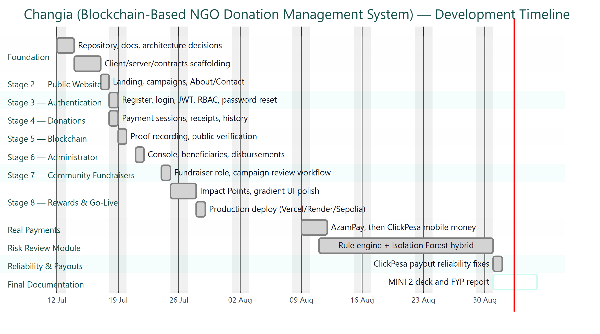
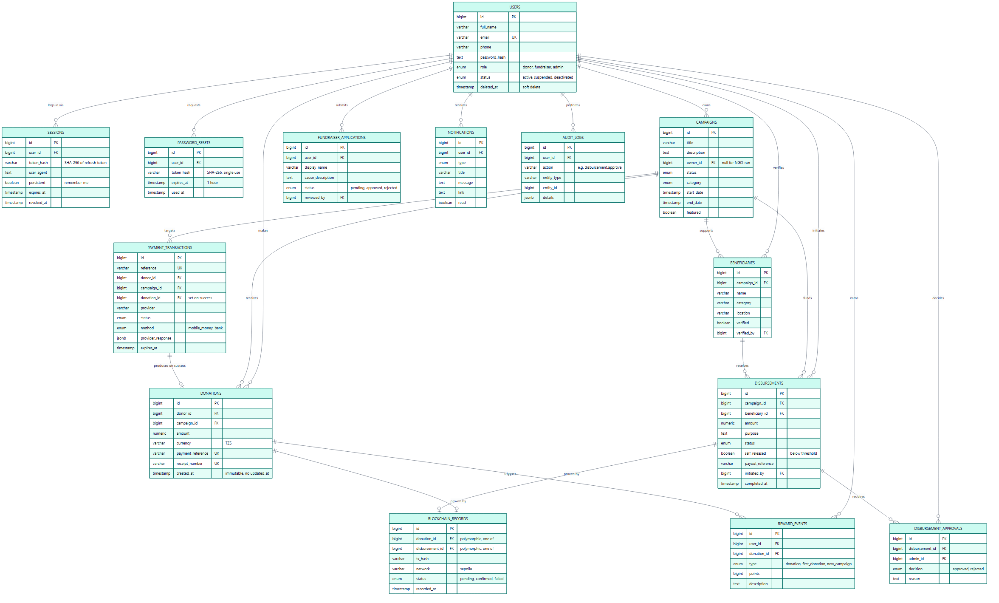

# APPENDICES {-}

## Appendix A: Questionnaire {-}

A structured Google Forms questionnaire was shared through Tanzania Red Cross
Society cooperation chat groups and among fellow students (Section 3.3) to
gather early problem and preference themes ahead of design. It received 26
responses. Individual response rows were not retained; the instrument and the
aggregated per-question summary below are reproduced from the retained chart
export.

### A.1 Instrument {-}

| # | Question | Response type |
|---|---|---|
| 1 | Do you trust current NGO donation systems? | Yes / No / Not Sure |
| 2 | Can you easily track how your donation is used after donating? | Yes / No / Sometimes |
| 3 | Do you think NGOs should provide transparent donation tracking? | Yes / No |
| 4 | Do you think blockchain can improve transparency in NGO donations? | Yes / No / Not Sure |
| 5 | Do NGOs need better systems for managing donations? | Yes / Maybe / No |

Table: Table A.1: Questionnaire instrument {#tbl:questionnaire-instrument}

### A.2 Aggregated Responses (n = 26) {-}

| # | Question | Response breakdown |
|---|---|---|
| 1 | Do you trust current NGO donation systems? | No 42.3%, Not Sure 53.8%, Yes 3.9% |
| 2 | Can you easily track how your donation is used after donating? | No 61.5%, Sometimes 38.5% |
| 3 | Do you think NGOs should provide transparent donation tracking? | Yes 100% |
| 4 | Do you think blockchain can improve transparency in NGO donations? | Yes 76.9%, Not Sure 23.1% |
| 5 | Do NGOs need better systems for managing donations? | Yes 76.9%, Maybe 23.1% |

Table: Table A.2: Aggregated response summary {#tbl:questionnaire-summary}

These results are a convenience sample, not a representative survey, and are
used as directional evidence for the design themes in Section 4.3: uncertain
trust in existing systems, difficulty tracking a donation after payment,
near-unanimous demand for transparent tracking, majority support for
blockchain-backed verification, and majority demand for better donation
management tooling.

## Appendix B: Document Review Matrix {-}

Document review was one of the three data-gathering methods (Section 3.7),
alongside the questionnaire and observation of the developed application.

| Document / system | Source | Year | Scope | Finding taken |
|---|---|---|---|---|
| Effect of blockchain-based donation system on trustworthiness of NPOs | Sung, Bock & Kim, *Information & Management* [@sung2023] | 2023 | Blockchain donation platform, trust perception | Transparency, immutability and efficiency improve perceived nonprofit trustworthiness |
| Crypto-giving and surveillance philanthropy | Howson, *Nonprofit Management and Leadership* [@howson2021] | 2021 | Governance trade-offs in crypto-giving | Technology alone does not resolve governance; role separation and audit trails still needed |
| Blockchain-based donations traceability framework | Alabdulkarim et al., *J. King Saud Univ. CIS* [@alabdulkarim2022] | 2022 | Traceability framework design | Immutable event records and end-to-end traceability address uncertainty over fund use |
| A framework to make charity collection transparent and auditable using blockchain | Muneeb et al., *Computers & Electrical Engineering* [@muneeb2020] | 2020 | Charity collection auditability | Cryptocurrency-first design creates an adoption mismatch for mobile-money users |
| Tanzania Economic Update | World Bank [@worldbank2017] | 2017 | Financial inclusion, mobile money | Mobile money is a major contributor to financial inclusion in Tanzania, motivating fiat-first payment design |
| MINI 1 prior submission (`NASIBU Y ISAKA 2106307225519.pdf`) | Candidate's own earlier report | 2026 | Prior proposal for the same project | Retained: problem statement, questionnaire instrument and raw response chart export (reproduced in Appendix A) |
| `docs/BUSINESS_RULES.md` | Internal architecture documentation | 2026 | Donation, disbursement and audit rules | Dual-approval threshold, beneficiary verification, immutability rules |
| `docs/SECURITY.md` | Internal architecture documentation | 2026 | Authentication and data protection | JWT/refresh rotation, bcrypt, RBAC, rate limiting design |
| `docs/PAYMENT_ARCHITECTURE.md` | Internal architecture documentation | 2026 | Payment provider abstraction | Provider-agnostic session/callback pattern behind a single service boundary |
| `docs/BLOCKCHAIN_ARCHITECTURE.md` | Internal architecture documentation | 2026 | Proof recording design | Backend-only chain access; deterministic proof hash; no PII on-chain |
| `deployment/RUNBOOK.md` | Internal deployment documentation | 2026 | Production hosting | Free-tier hosting topology reproduced in Appendix E |

Table: Table B.1: Document review matrix {#tbl:doc-review}

## Appendix C: Source Code (selected excerpts) {-}

Three excerpts illustrate the controls most central to the project's
accountability claims: a recomputable proof hash, an idempotent payment
callback, and the dual-approval disbursement rule.

### C.1 Deterministic Proof Hash {-}

`server/src/services/blockchain.service.ts`

```ts
/**
 * Deterministic proof hash (Decision 010): SHA-256 over donation ID, campaign
 * ID, amount, receipt number, payment reference and timestamp. Recomputable
 * from the donation row alone, so verification never needs extra storage.
 */
export function computeProofHash(input: {
  donationId: number
  campaignId: number
  amount: number
  receiptNumber: string
  paymentReference: string
  createdAt: Date
}): string {
  const payload = [
    input.donationId,
    input.campaignId,
    input.amount,
    input.receiptNumber,
    input.paymentReference,
    input.createdAt.toISOString(),
  ].join(':')
  return `0x${createHash('sha256').update(payload).digest('hex')}`
}
```

Because the hash is a pure function of the donation row, public verification
(Section 6.11) never needs to store a second copy of the proof input; it
recomputes the hash and compares it against the on-chain record.

### C.2 Idempotent Payment Callback {-}

`server/src/services/payment.service.ts`

```ts
/**
 * Handle a provider callback: verify authenticity, then either finalize the
 * donation or mark the attempt terminal. Idempotent, so duplicate callbacks
 * never double-record (flows/payment-flow.md).
 */
export async function handleCallback(
  payload: unknown,
  context?: CallbackContext,
): Promise<CallbackResult> {
  const provider = getPaymentProvider()
  const reference = provider.extractReference(payload)
  if (!reference) throw ApiError.badRequest('Invalid payment callback')

  const transaction = await findTransactionByReference(reference)
  if (!transaction) throw ApiError.notFound('Payment not found')

  const result = provider.verifyCallback(payload, transaction, context)
  if (!result.verified) throw ApiError.badRequest('Payment callback could not be verified')

  return settleTransaction(transaction, reference, result)
}

// Both webhooks and the ClickPesa status recovery path call settleTransaction,
// so a delayed or duplicated webhook cannot double-credit a donor.
async function settleTransaction(transaction, reference, result) {
  if (transaction.status === 'success') {
    // Already finalized: return the existing donation without re-processing.
    return { status: 'success', reference, donationId: transaction.donationId ?? undefined }
  }
  // ...creates the donation and payment_transactions rows atomically.
}
```

This guard is what makes payment finalisation safe under retried or
duplicated gateway webhooks (Section 7.6, TC-02).

### C.3 Dual-Approval Disbursement Rule {-}

`server/src/services/disbursement.service.ts`

```ts
/**
 * A payout that keeps the campaign under the dual-approval threshold is
 * auto-approved and paid immediately; one that reaches it waits for a
 * separate administrator's decision (Decision 020).
 */
let requiresApproval: boolean
if (actor.role === 'admin') {
  // Administrators keep the per-payout rule (Decision 016).
  requiresApproval = input.amount >= DUAL_APPROVAL_THRESHOLD_TZS
} else {
  // Fundraisers are measured on the campaign's cumulative self-released total.
  const cumulative = await getCumulativeSelfReleased(input.campaignId)
  requiresApproval = cumulative + input.amount >= DUAL_APPROVAL_THRESHOLD_TZS
}
const autoApproved = !requiresApproval
```

The initiator and the approver are always different administrator accounts
(Section 7.6, TC-06), so a single compromised or careless account cannot
release a large payout unilaterally.

## Appendix D: User Manual {-}

Condensed from `README.md` and the role flows in `flows/donor-flow.md`,
`flows/admin-flow.md` and `docs/PRODUCT.md`. All three roles share one
sign-in screen; the application routes each role to its own console after
login.

### D.1 Donor {-}

1. Open the landing page and browse active campaigns, or search and filter by category.
2. Open a campaign's details page to read its description, goal and raised amount.
3. Select **Donate**, registering or logging in first if not already signed in.
4. Enter an amount, choose a payment method (mobile money or bank), and review the donation.
5. Complete payment at the provider; on a verified callback the platform issues a receipt.
6. From **My Donations**, download the receipt, view donation history, and open **Verify** to see the donation's blockchain proof status.
7. The donor dashboard also shows Impact Points earned and the campaigns the donor supports.

### D.2 Fundraiser {-}

1. A donor applies to become a fundraiser; an administrator reviews the application (approve or reject with a reason).
2. Once approved, the fundraiser opens their console to create a campaign (title, description, category, goal, dates, image).
3. A new campaign starts in **Pending Review**; it is not publicly visible until an administrator approves it.
4. Once active, the fundraiser adds beneficiaries to the campaign; an administrator must verify each beneficiary before it can receive a payout.
5. The fundraiser initiates disbursements to verified beneficiaries. Payouts that keep the campaign's cumulative self-released total under the dual-approval threshold pay out immediately; payouts that reach the threshold wait for administrator approval.
6. The fundraiser dashboard shows raised totals, disbursed totals and stat tiles per campaign.

### D.3 Administrator {-}

1. Sign in and land on the admin dashboard, which summarises campaigns, donations and pending review queues.
2. Review fundraiser applications and fundraiser-submitted campaigns (approve or reject with a reason).
3. Manage beneficiaries: verify submitted beneficiaries before they become payout-eligible.
4. Manage users: change account status, or promote a user to administrator.
5. Approve or reject disbursements that reached the dual-approval threshold; an administrator can never approve their own initiated payout (Section 7.6, TC-06).
6. Open **Reports** for exports, **Audit Logs** for the immutable action history, and **Notifications** for system alerts.
7. When the integrated risk-review module is enabled, review the fraud/anomaly queue for unusual completed donations.

## Appendix E: Installation Guide {-}

Condensed from `README.md` (local development) and
`deployment/RUNBOOK.md` (production deploy, reproduced in full there).

### E.1 Local Development {-}

Prerequisites: Node.js LTS and a PostgreSQL database (a free Neon instance works).

```bash
# Client (frontend) — http://localhost:5173
cd client
npm install
npm run dev

# Server (backend) — http://localhost:4000
cd server
npm install
cp .env.example .env   # set DATABASE_URL and secrets
npm run dev

# Contracts (blockchain, local Hardhat node)
cd contracts
npm install
npm run compile
npm test
npm run node             # local chain
npm run deploy:local     # deploy to local chain
```

Each package carries its own `.env.example`; `.env` files are never committed.

### E.2 Production Deployment (summary) {-}

The live deployment (Table E.1) follows the five ordered steps in
`deployment/RUNBOOK.md`: deploy the proof contract to Sepolia, provision
Neon PostgreSQL and seed the first administrator, push to GitHub, deploy the
backend on Render from `render.yaml`, and deploy the frontend on Vercel with
`VITE_API_BASE_URL` pointed at the Render URL. `CLIENT_ORIGIN` on the backend
must then be set to the exact Vercel URL for cross-site cookies to work.

| Tier | Host | Notes |
|---|---|---|
| Frontend | Vercel (static) | Root directory `client`; SPA rewrite via `client/vercel.json` |
| Backend | Render (Node web service) | Free tier sleeps after ~15 min idle; first request then takes 30 to 60 seconds |
| Database | Neon (managed PostgreSQL) | Same instance as local development |
| Blockchain | Ethereum Sepolia | Contract address recorded in the runbook |

Table: Table E.1: Production hosting topology {#tbl:hosting}

## Appendix F: Test Cases {-}

Combines the API/workflow test cases summarised in Section 7.6, the Hardhat
smart-contract unit tests, and the manual cross-browser and responsive
checklist. All automated cases pass as of the latest test run.

### F.1 API and Workflow Test Cases {-}

| ID | Description | Precondition | Steps | Expected Result | Status |
|---|---|---|---|---|---|
| TC-01 | Registration | None | Submit valid registration details | Account and session created | Pass |
| TC-02 | Duplicate callback | A pending payment session exists | Send the same provider callback twice | Exactly one donation and one credit; second call is a no-op | Pass |
| TC-03 | Public proof lookup | A completed donation exists | Look up the donation by receipt number | Status returned without donor identity or payment reference | Pass |
| TC-04 | Campaign review | Fundraiser submits a campaign | Fundraiser saves a new campaign | Campaign is not publicly visible before administrator approval | Pass |
| TC-05 | Beneficiary control | Beneficiary not yet verified | Fundraiser initiates a payout to that beneficiary | Payout request is rejected | Pass |
| TC-06 | Separation of duties | Disbursement pending approval, initiated by admin A | Admin A attempts to approve their own disbursement | Approval is rejected | Pass |
| TC-07 | Balance control | Requested amount exceeds campaign's available balance | Initiate a disbursement above the balance | Request is rejected | Pass |
| TC-08 | Duplicate proof | A proof already exists on-chain for an identifier | Attempt to register the same identifier again | Contract reverts with `ProofAlreadyExists` | Pass |

Table: Table F.1: API and workflow test cases {#tbl:tc-full}

### F.2 Smart Contract Unit Tests {-}

`contracts/test/TransparencyRegistry.test.ts` (Hardhat, Chai), 4 tests:

| Test | Assertion | Status |
|---|---|---|
| Records and verifies a donation proof | `verifyDonation` returns true; `donationCount` increments; stored campaign ID and proof hash match the input | Pass |
| Rejects duplicate donation proofs | Registering the same donation ID twice reverts with `ProofAlreadyExists` | Pass |
| Blocks a non-owner from recording proofs | A non-owner call to `registerDonation` reverts with `NotOwner` | Pass |
| Records donation and disbursement independently | A donation proof and a disbursement proof for the same campaign are stored and verified separately | Pass |

Table: Table F.2: Smart contract unit tests {#tbl:tc-contract}

### F.3 Manual and Responsive Testing Checklist {-}

Source: `testing/manual-testing.md`. Executed against the local build before
each deployment.

| Area | Checks |
|---|---|
| Authentication | Register, login, logout, forgot password |
| Campaigns | Create, publish, edit, delete |
| Donations | Mobile money, bank, receipt verification, blockchain proof verification |
| Dashboard | Statistics, reports, notifications |
| Beneficiaries | Add, edit, link to campaign |
| Responsive | Desktop, tablet, mobile breakpoints |
| Browser | Chrome, Edge, Firefox |

Table: Table F.3: Manual and responsive testing checklist {#tbl:tc-manual}

## Appendix G: Gantt Chart {-}

Derived directly from the repository's commit history (`git log`), not
re-estimated after the fact. Each stage's date is the day its milestone
commit (for example `docs: mark Stage 6 administrator complete`) landed.

{#fig:gantt width=100%}

| Phase | Dates (2026) |
|---|---|
| Foundation (scaffolding, architecture) | 12 Jul to 17 Jul |
| Stage 2: Public website | 17 Jul |
| Stage 3: Authentication | 18 Jul |
| Stage 4: Donations | 18 Jul |
| Stage 5: Blockchain proof | 19 Jul |
| Stage 6: Administrator console | 21 Jul |
| Stage 7: Community fundraisers | 24 Jul to 25 Jul |
| Stage 8: Impact Points and go-live | 25 Jul to 29 Jul |
| Real payments (AzamPay, then ClickPesa) | 9 Aug to 12 Aug |
| Integrated risk-review module | 11 Aug to 31 Aug |
| Reliability and payout fixes | 31 Aug to 1 Sep |
| Final documentation (this report, MINI 2 deck) | 31 Aug to submission |

Table: Table G.1: Development phases by date {#tbl:gantt-table}

## Appendix H: Budget {-}

The deployed system uses free tiers throughout; the only recurring cost the
project would add is an optional custom domain.

| Item | Provider | Tier used | Monthly cost |
|---|---|---|---|
| Frontend hosting | Vercel | Free (Hobby) | TZS 0 |
| Backend hosting | Render | Free (sleeps after ~15 min idle) | TZS 0 |
| Database | Neon PostgreSQL | Free | TZS 0 |
| Blockchain RPC | Alchemy / public Sepolia RPC | Free | TZS 0 |
| Test ETH (Sepolia) | Public faucet | Free | TZS 0 |
| Domain name | Optional, not purchased | — | ~USD 12/year if added |
| Backend always-on upgrade | Render Starter (optional) | Paid | ~USD 7/month if added |

Table: Table H.1: Project budget {#tbl:budget}

Developer time is not costed, as this is an academic final year project
rather than a commissioned engagement.

## Appendix I: Additional Screenshots {-}

Pending, consistent with Section 7.9: screenshots are captured from the live
deployment (`https://changia-hazel.vercel.app`) immediately before submission
so they reflect the exact system evaluated, rather than an earlier state that
could go stale before the viva.

## Appendix J: Full Entity Relationship Diagram {-}

The core-entity diagram in Section 6.4.1 omits supporting tables for
readability. All 14 tables are shown below.

{#fig:erd-full width=100%}
